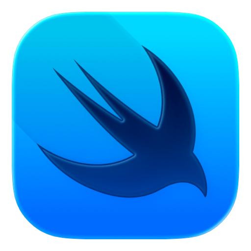
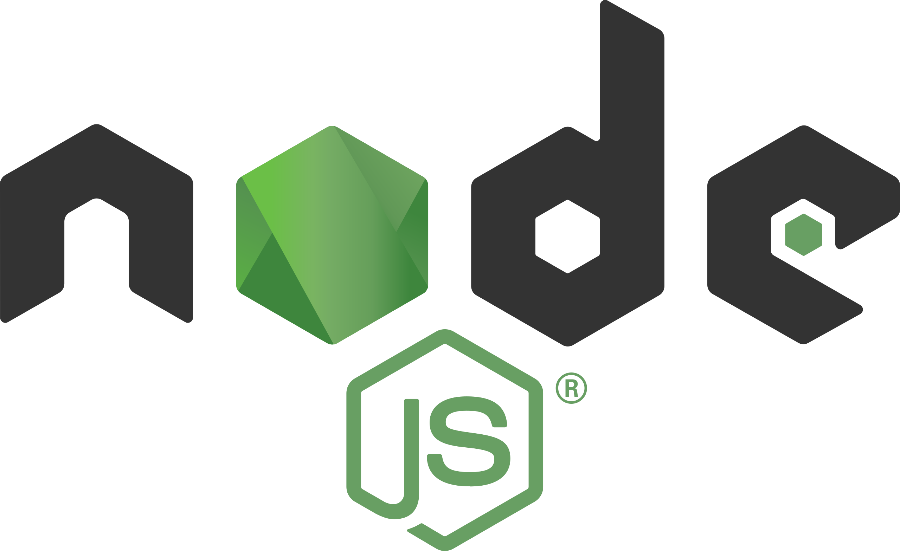

# I'm  Douglas Oroko 👋

I am a passionate software developer with experience in UI/UX design, frontend development, and backend development. I specialize in building modern, scalable, and user-friendly applications using cross-platform and web technologies.

I have worked with technologies such as Flutter for cross-platform mobile development, ReactJS for modern web interfaces, and Node.js with Express for backend services and APIs. I also have experience working with both SQL and NoSQL databases, ensuring efficient data management and seamless application integration.

---

## My Stacks

<table >
  <tr>
    <td >
      
    </td>
    <td >
      
    </td>
    <td >
      
    </td>
        <td >
      
    </td>
    <td >
      
    </td>
    <td >
      
    </td>
    <td >
      
    </td>
  </tr>
    <tr>
    <td >
      Flutter
    </td>
    <td >
      Dart
    </td>
    <td >
      SwiftUI
    </td>
    <td >
      SQL
    </td>
    <td >
      Node.js
    </td>
    <td >
      GitHub
    </td>
  </tr>
</table>

<!--  -->

## Languages

## Streak

